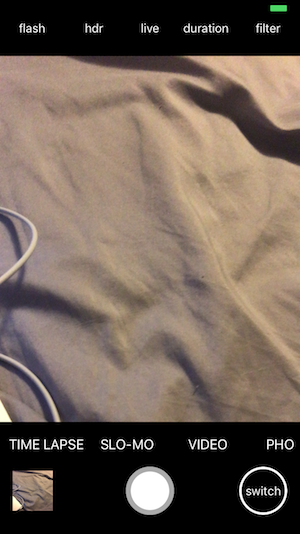
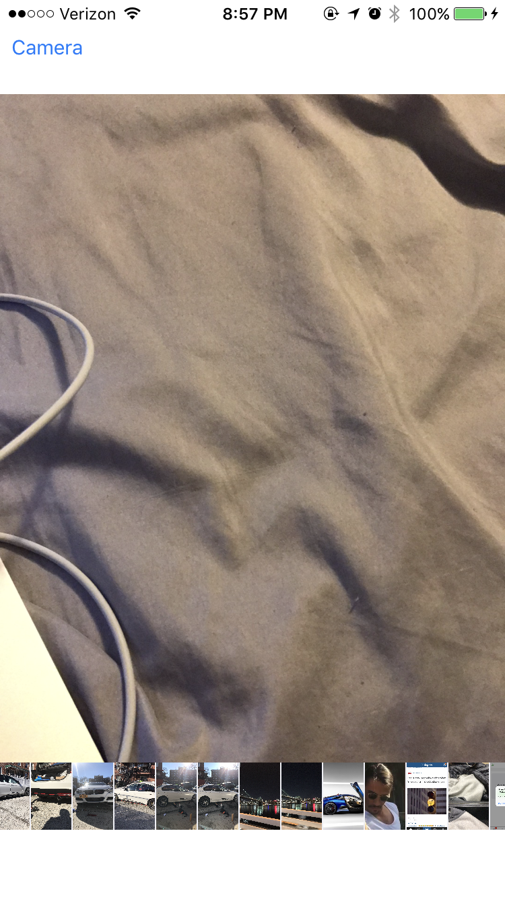
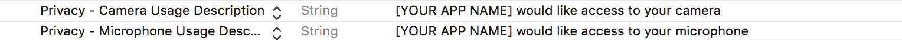
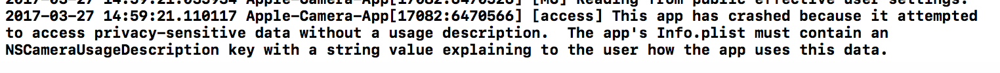

# Apple-Camera-App

A less detailed version of the Apple Camera App to demonstrate some features.

Some features were purposely left un-implemented.

The list of things left un-implemented are:

CameraController.swift :
 
the buttons at the top var (flash, hdr, live, duration and filter) 
 
the actions of each camera option in the bottom bar
 
Recording videos

 
 
 

SinglePhotoViewController.swift :
 
The buttons in the bottom bar
 
 
 

This is NOT intended for sale!

Be sure to add these two to your info.plist or you will surely receive an error.

"NSCameraUsageDescription" with a string of what ever you like

"NSPhotoLibraryUsageDescription" with a string of what ever you like

"NSMicrophoneUsageDescription" with a string of whatever you like
 

 
 

This is the error you will receive.
 

